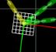
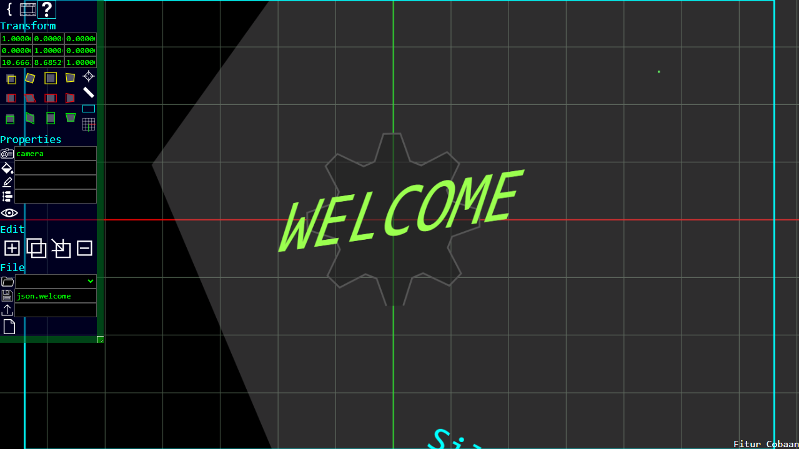
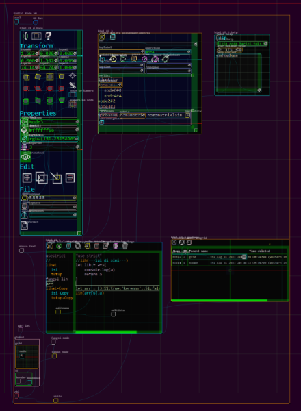
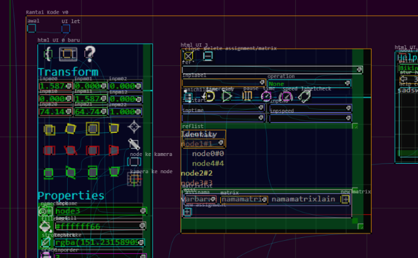

#  RantaiKode
  
  
  
Rantai Kode, web visual programming yang dilengkapi dengan animasi berupa susunan beberapa node.  
Matrix 3x3 digunakan untuk transformasi objek animasi agar bisa geser, putar, skala, dan perspective.  
  
Silakan kunjungi [Rantai Kode v0](https://angkasamuhammad.github.io/RantaiKode/Rantai%20Kode%20v0.html)  
  
Web ini dibuat menggunakan project sebelumnya, yaitu [Tandakurung Node](https://github.com/AngkasaMuhammad/TandakurungNode)  
Silakan download 
   
  
### 1. Halaman Utama
 

### 2. Halaman Data
 

### 3. Halaman Sampah
 

### 4. Halaman Animasi
 

### 5. Halaman Help
 

